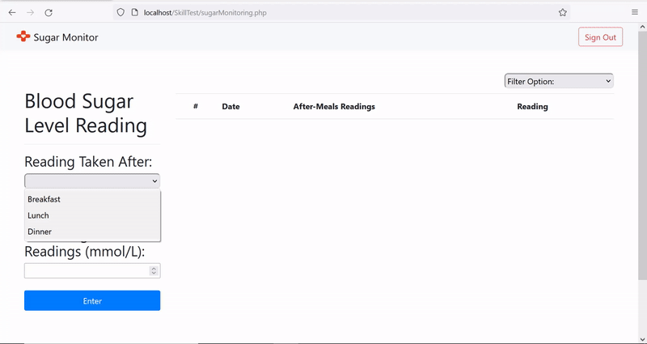

# SugarMonitoring
A website to monitor your sugar intake after meals.

## Background:
As part of my Web Applications Development in PHP module, we were tasked to create a website that tracks sugar intakes. The provided template files for my assessments are provided [here](/C203_skill_test_material).  

I hosted the website and database locally using XAMPP. XAMPP is a completely free, easy to install Apache distribution containing MariaDB, PHP, and Perl. The database setup is provided [here](/C203_skill_test_material/C203_SkillTestSQL.sql).  

I have also incorporated the use of Bootstrap 4. Bootstrap is the most popular CSS Framework for developing responsive and mobile-first websites.

## Website Features:
Home page has animated text and images:  

You are able to filter the table to only show readings that are either normal, elevated or high:  

when there are too many records, the webpage creates a scroll view for the table:  

The webpage adapts to resizing:  

Failed login:  

Sign up:  

Login:  

Entering a reading:  

## References:
https://www.apachefriends.org/index.html  
https://getbootstrap.com/  
https://www.w3schools.com/whatis/whatis_bootstrap.asp  

